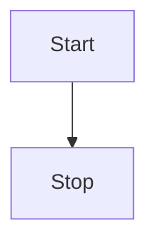

# Лабораторна робота №2

$\sqrt{p(p-a)(p-b)(p-c)}$ $S=\pi r^2$

```python
import math
a = 11.3
b = 15.9
c = 20.7
mb = math.sqrt(2*(math.pow(a,2))+2*(math.pow(c,2))-(math.pow(b,2)))/2
p = (a+b+c)/2
s = math.sqrt(p*(p-a)*(p-b)*(p-c))
hc = (2*s)/c
print("mediana mb = ", mb)
print("Vusota hc = ",hc)

```



Результат
```console
mediana mb =  14.659041578493458
Vusota hc =  8.601957500447575
 
```
